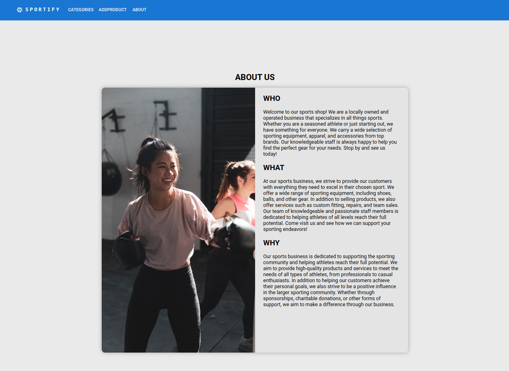

# Sportify Web Store

Front Page

Product Category Select

Single Product View

Add product

About Us

Mobile Responsive

## Table of contents

- [Sportify Web Store](#sportify-web-store)
  - [Table of contents](#table-of-contents)
  - [Overview](#overview)
    - [The challenge](#the-challenge)
    - [Links](#links)
    - [Built with](#built-with)
  - [Acknowledgments](#acknowledgments)

## Overview

### The challenge

Users should be able to:

- View the optimal layout depending on their device's screen size
- Sort products according to different parameters like: "name" and "price" in descending or ascending order, and also sort according to product category.
- Add new products.
- Edit existing products.
- Single page view for individual products.

### Links

- Solution URL: [Visit my GitHub](https://github.com/AlexanderWiklow/React-Project-Sports-Items-Web-Store)
<!-- - Live Site URL: [Visit this live project](https://alexanderwiklow.github.io/Project-Landing-Page/product-list-page.html) -->

<!-- ## My process -->

### Built with

- Semantic HTML5 markup
- CSS custom properties
- Flexbox
- JavaScript
- React
- Grid
- SASS
- Lodash
- Material UI

<!-- ### Continued development -->

<!-- ## Author

- Website - [Alexander Wiklöw](https://github.com/AlexanderWiklow/Project-Landing-Page) -->

## Acknowledgments

Thanks Jonas Stattin who helped me through this project.
